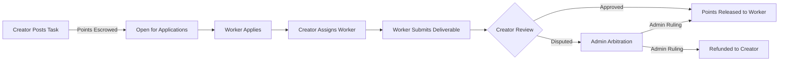

# Skill Sprout

> **Empowering growth through peer-to-peer skill exchange and collaborative task fulfillment.**

---

## 📖 Abstract

In an increasingly dynamic digital economy, acquiring practical knowledge, receiving mentorship, and accomplishing specialized tasks often present financial and accessibility barriers. **Skill Sprout** is a web-based collaborative skill exchange and task fulfillment ecosystem designed to democratize peer learning and micro-task collaboration. 

Instead of relying solely on traditional fiat currencies for micro-engagements, Skill Sprout introduces a meritocratic tokenized economy driven by **Work Points (WP)**. Users earn Work Points by deploying their proficiencies—such as programming, graphic design, content writing, translation, or academic guidance—to complete tasks posted by their peers. Earned points can subsequently be reinvested to solicit assistance, mentorship, or service deliverables from other talented individuals across the community.

Supported by an atomic escrow mechanism, rigorous moderation standards, and a dedicated **Admin Management Suite**, Skill Sprout establishes a secure, transparent, and fair environment for personal and professional growth.

---

## 💡 Basic Concept

Skill Sprout operates on three foundational principles:

1. **Talent as Currency**: Every user possesses valuable expertise. By completing tasks for others, users transform their skills into Work Points (WP). The economy is strictly pegged at **1 Work Point = Rs. 1** (1 WP = 1 Rupee), ensuring transparent real-world value alignment.
2. **Collaborative Growth**: Whether seeking code reviews, creative designs, tutoring, or technical troubleshooting, users can post structured tasks with clear requirements, milestones, and reward allocations. Task deadlines must strictly be scheduled for future dates (at least tomorrow).
3. **Guaranteed Trust via Escrow**: When a task is commissioned, the reward points are locked securely in an escrow engine. The funds are released to the worker only once the task creator reviews and accepts the submitted deliverables, ensuring protection for both parties.

### Primary User Roles
* **Task Creator (Client / Learner)**: Posts task requirements, defines future deadlines, locks reward points in escrow, selects applicants, and reviews submitted deliverables.
* **Task Worker (Contributor / Mentor)**: Browses open opportunities matching their skill set, submits proposals, delivers completed work, and earns Work Points upon approval.
* **Platform Administrator**: Supervises system operations, arbitrates disputes, ensures content integrity, oversees financial/point health, and maintains platform security.

---

## 🛡️ Admin Module & Administration System

The **Admin Portal** serves as the central command and control center of Skill Sprout, equipping platform operators with complete governance over user accounts, task authenticity, transactional integrity, and dispute settlement.

### 1. Admin Authentication & Role-Based Access Control (RBAC)
* **Secure Admin Access**: Dedicated administrative authentication gateway with separate session lifecycles, brute-force defense, and activity logging.
* **Tiered Privileges**: Role differentiation between *Super Administrators* (full system control, database operations, configuration) and *Moderators* (task reviews, community support, dispute handling).

### 2. User Management & Account Governance
* **User Directory**: Centralized ledger displaying registered members, verification status, contact details, account standing, and Work Point balances.
* **Account Status Controls**: Ability to activate, warn, suspend, or permanently ban accounts engaging in fraudulent activity, harassment, or Terms of Service violations.
* **Balance Adjustments & Auditing**: Administrative ability to inspect balance histories and issue manual adjustments with mandatory audit reason logging.

### 3. Task & Content Moderation
* **Task Oversight**: Comprehensive view of all platform tasks categorized by state (`OPEN`, `ASSIGNED`, `SUBMITTED`, `COMPLETED`, `CANCELLED`).
* **Content Filtering & Takedown**: Review flagged or reported tasks, removing illicit requests, spam, duplicate listings, or inappropriate material.
* **Deliverable Inspection**: Authority to examine uploaded submissions and files in cases of reported abuse or copyright infringement.

### 4. Dispute Resolution & Escrow Arbitration
* **Conflict Escalation Portal**: A dedicated queue for contested tasks where creators reject submissions or workers allege unfair rejection.
* **Evidence Review**: Admins review original task requirements, application messages, revision histories, and uploaded proof of work.
* **Binding Arbitration Actions**:
  * *Approve & Release*: Force-release escrowed Work Points to the worker.
  * *Refund to Creator*: Cancel the task and return escrowed points to the creator.
  * *Split Allocation*: Disburse partial compensation based on milestone completion.

### 5. Financial & Work Points Ledger Oversight
* **Platform Ledger**: Track system-wide circulating supply of Work Points, aggregate creation incentives, and points spent.
* **Purchase & Top-Up Verification**: Inspect transaction logs for fiat-to-WP package purchases, monitor payment gateways, and flag irregular top-up behavior.
* **Package Management**: Configure Work Point purchase packages, bonus rates, and pricing tiers.

### 6. Analytics, Metrics & Reporting Dashboard
* **KPI Telemetry**: Real-time visualization of platform growth, including:
  * Total & Daily Active Users (DAU)
  * Task velocity (posted vs. completed vs. cancelled)
  * Escrow lock volume & platform point velocity
  * Dispute rate and resolution turnaround time
* **System Logs**: Audit trails tracking admin actions, privilege changes, and critical security events.

### 7. Global Platform Settings
* **System Toggles**: Enable maintenance mode, adjust default registration bonuses, set minimum task reward thresholds, and manage announcement banners.
* **Skill Categories & Tags**: Create, edit, and organize taxonomy for task skill classifications.

---

## 🔄 Platform Workflow Summary

---

## 🛠️ Technology Stack
* **Frontend**: HTML5, Semantic CSS3 (Unified Monochromatic 3-Gray & Green System), Vanilla JavaScript
* **Backend**: PHP (Modular, secure prepared statements, session management)
* **Database**: MySQL / MariaDB (InnoDB engine, relational foreign keys, atomic transactions)
* **Web Server**: Apache (XAMPP Environment, URL rewriting via `.htaccess`)

### 🎨 Design System: Monochromatic (3 Grays + Green)
The platform user interface—spanning public pages, authenticated user views, and the admin panel—adheres to a cohesive, unified palette:
* **Gray 1 (Canvas / Body Background)**: `#111215` (Deep dark canvas)
* **Gray 2 (Surfaces / Cards / Elevated Panels)**: `#1c1d22` (Card surface)
* **Gray 3 (Structural Borders & Dividers)**: `#2e3038` (Precision outlines)
* **Signature Emerald Green**: `#10b981` (Primary actions, brand emblems, and progress states)
* **Unified Admin Panel**: Admin controls share the identical surface tokens and design hierarchy as the user portal.
